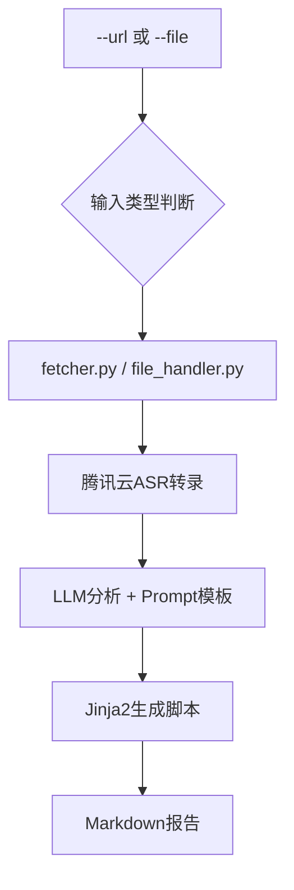

# 🎯 AI外联军师 (Creator Compass)

> 一个AI辅助的博主分析工具，支持URL链接和本地文件两种输入模式，快速分析博主视频内容并生成个性化的破冰私信脚本

## 📋 项目概述

**AI外联军师**是一个专为独立开发者设计的内部命令行工具，旨在通过AI技术分析博主视频内容，自动生成个性化的沟通脚本，将手工外联工作升级为体系化、高效率的作战流程。

### 🚀 核心特色

- **🔄 混合输入模式**: 支持`--url`(在线抓取)和`--file`(本地文件)两种输入方式
- **📦 批量处理**: 支持批量处理文件夹中的多个MP4文件，智能去重和进度跟踪
- **🎯 博主综合分析**: 整合博主基础信息和多个视频内容，生成综合分析报告
- **🎵 音频转录**: 通过yt-dlp + 腾讯云ASR绕过硬字幕限制，直接从音频获取文本
- **💾 智能缓存**: 音频转录缓存系统，避免重复ASR调用，提高处理效率
- **🤖 AI洞察**: 基于DeepSeek/OpenAI + 可配置Prompt模板分析博主特征
- **📝 脚本生成**: 自动生成两套个性化沟通脚本模板
- **📊 策略简报**: 输出完整的Markdown格式外联策略简报

### 🏗️ 技术架构 (V5.0)

**核心设计**: "混合输入模式"+"可配置化Prompt"策略



### 📊 技术栈

| 组件 | 技术选型 | 核心理由 |
|------|----------|----------|
| **主语言** | Python 3.11+ | 强大的文本处理能力和丰富的AI生态 |
| **信息抓取** | yt-dlp | 支持几乎所有主流视频平台，能精准提取音频流 |
| **语音转文字** | 腾讯云ASR | 与现有云服务生态一致，集成顺畅，成本可控 |
| **AI模型** | DeepSeek/OpenAI | 以DeepSeek为首选，OpenAI为备选，兼顾性能与成本 |
| **模板引擎** | Jinja2 | 功能强大，语法简洁，用于动态生成报告和脚本 |
| **命令行解析** | Typer | 基于类型提示自动生成CLI，代码简洁现代，开发体验极佳 |
| **代码规范** | Ruff | 超高速的Linter和Formatter，一体化代码质量管理 |

## 🚀 快速开始

### 环境要求

- Python 3.11+
- 腾讯云ASR API密钥
- DeepSeek/OpenAI API密钥

### 安装依赖

```bash
# 创建虚拟环境
python -m venv venv
source venv/bin/activate  # Windows: venv\Scripts\activate

# 安装依赖
pip install -r requirements.txt
```

### 配置环境变量

```bash
# 复制环境变量模板
cp .env.example .env

# 编辑配置文件，填入你的API密钥
nano .env
```

### 使用方法

#### 单文件分析
```bash
# 方式1: URL链接分析 (B站、YouTube等) - 优先提取字幕
python main.py analyze --url "https://www.bilibili.com/video/BV14e8JzdEgH/?spm_id_from=333.1007.tianma.2-2-5.click&vd_source=976833e5802fbddc07ce1803775b1e06"

# 方式2: 本地文件分析 (推荐用于抖音等复杂平台)
python main.py analyze --file "/path/to/downloaded/video.mp4"

# 详细输出（调试模式）
python main.py analyze --file "video.mp4" --verbose
```

#### 批量处理
```bash
# 批量处理文件夹中的所有MP4文件
python main.py batch /path/to/videos

# 批量处理，启用详细输出
python main.py batch docs/data --verbose

# 限制处理数量（适用于大批量文件）
python main.py batch docs/data --max 10 --verbose
```

#### 博主综合分析
```bash
# 分析博主文件夹（包含基础信息和多个视频）
python main.py blogger-analysis "/path/to/11-博主-穷听 - jjjin0"

# 博主综合分析，启用详细输出
python main.py blogger-analysis "/path/to/博主文件夹" --verbose
```

#### 批量“博主综合分析”（推荐）

- 使用现有脚本 `quick_batch.py` 遍历“博主根目录”下的每个子文件夹，并为每个博主执行综合分析。
- 先在 `quick_batch.py` 第 14 行设置你的“博主根目录”绝对路径，例如：

```python
base_path = Path("/absolute/path/to/博主根目录")
```

- 运行批量脚本：

```bash
python /Users/liumingwei/01-project/12-liumw/12-creator-compass/quick_batch.py
```

- 目录要求：每个“博主文件夹”需包含基础信息文件 `人物 - *.md` 与至少一个 `*.mp4` 视频文件。
- 说明：脚本会依次调用 `python main.py blogger-analysis "<子文件夹>" --verbose`，并在任务间隔 5 秒以降低限频风险。

#### 其他命令
```bash
# 检查配置
python main.py config-check

# 查看帮助
python main.py --help
python main.py batch --help
python main.py blogger-analysis --help
```

#### 输出文件
```text
outputs/
├── [博主名]-[视频标题]-[时间戳].md           # 单视频分析报告
├── 博主综合分析-[博主名]-[时间戳].md          # 博主综合分析报告
├── cache/                                    # 缓存目录
│   └── transcripts/                         # 音频转录缓存
└── transcripts/
    └── [博主名]-[视频标题]-[时间戳].txt      # 纯转录文本
```

## 📁 项目结构

```text
creator-compass/
├── main.py                    # 🎯 主流程入口 (Typer CLI)
├── src/                       # 📦 源代码目录
│   └── ai_outreach/           # 核心包
│       ├── __init__.py        # 包初始化文件
│       ├── fetcher.py         # 在线抓取模块 (yt-dlp封装)
│       ├── file_handler.py    # 本地文件处理模块
│       ├── transcriber.py     # ASR转录模块 (腾讯云ASR封装+缓存)
│       ├── analyzer.py        # AI分析模块 (LLM API封装)
│       ├── blogger_analyzer.py # 博主综合分析模块
│       ├── transcript_cache.py # 音频转录缓存模块
│       ├── generator.py       # 脚本生成模块 (Jinja2封装)
│       └── utils/             # 工具函数目录
│           ├── __init__.py    # 工具包初始化
│           ├── config.py      # 配置管理
│           ├── logger.py      # 日志工具
│           ├── exceptions.py  # 自定义异常
│           └── audio_utils.py # 音频处理工具
├── prompts/                   # 🧠 AI分析Prompt模板目录
│   ├── analyze_blogger_content.txt
│   └── extract_pain_points.txt
├── templates/                 # 📝 沟通脚本模板目录
│   ├── new_blogger_template.md     # 新锐博主破冰脚本
│   ├── known_blogger_template.md   # 旧识博主激活脚本
│   └── blogger_comprehensive_template.md # 博主综合分析报告模板
├── tests/                     # 🧪 测试文件目录
│   ├── test_*.py             # 单元测试和集成测试
│   └── __init__.py
├── outputs/                   # 📊 输出报告目录
│   ├── cache/                 # 缓存目录
│   │   └── transcripts/       # 音频转录缓存
│   └── transcripts/           # 📝 转录文本专用目录
├── temp/                      # 🗂️ 临时文件目录
├── docs/                      # 📚 项目文档
│   ├── 项目 - AI外联军师.md
│   ├── 架构 - AI外联军师.md (V5.0)
│   ├── 决策 - AI外联军师技术选型.md
│   └── development/           # 开发文档
├── requirements.txt           # 📋 Python依赖清单
├── .env.example              # ⚙️ 环境变量模板
└── README.md                 # 📖 项目说明文档
```

## 🤝 贡献指南

本项目目前处于内部MVP阶段，暂不接受外部贡献。

## 📄 许可证

本项目仅供内部使用，版权所有。

## 🔗 相关链接

- **代码仓库**: [GitHub](https://github.com/lmw-dev/creator-compass.git)
- **项目文档**: [docs/](./docs/)
- **开发文档**: [docs/development/](./docs/development/)
- **Linear Issue**: TOM-246

---

**🚀 让外联工作从手工作业升级为体系化作战！**