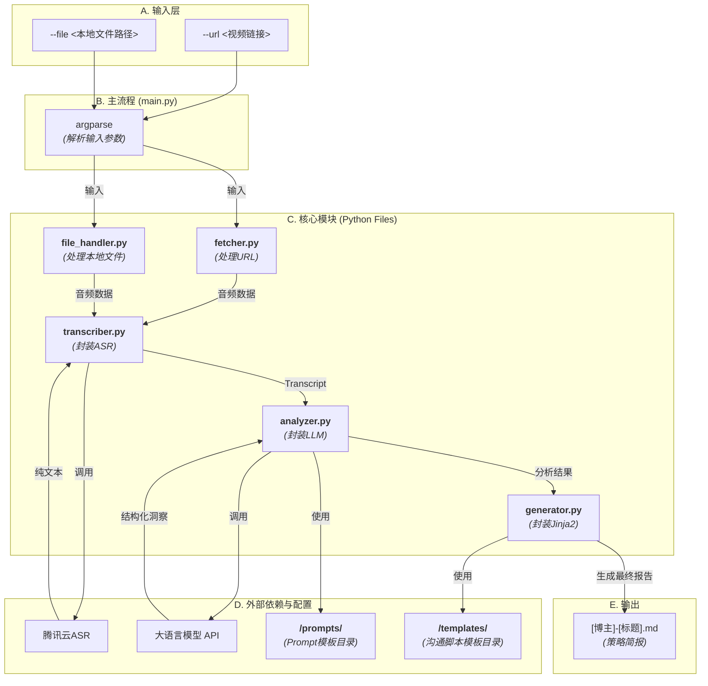

---
tags:
  - architecture
  - system-design
  - ai-outreach
parent: "[[项目 - AI外联军师]]"
status: active
---

# 架构 - AI外联军师 (V5.0 - 混合输入模式)

> [!tip] 核心架构
> > 本工具采用“混合输入模式”和“可配置化Prompt”的策略。优先尝试URL抓取，对复杂平台则切换到本地文件输入。所有AI分析的逻辑都由外部的Prompt模板文件驱动，便于快速优化和迭代。

## 1. 架构图
## 1.1 数据流架构图

## 1.2 最终架构与代码结构映射图

## 2. 核心技术决策分析

### 2.1 为什么采用“音频提取 + ASR转录”的架构？

在我们最初的技术构想中，曾考虑直接抓取视频的“字幕文件”作为分析的文本来源。然而，经过深入调研，我们发现此路不通，原因如下：

- **核心约束**: 我们的主要目标用户是**抖音博主**。
    
- **技术现实**: 抖音等主流短视频平台的视频，其字幕绝大多数是“**硬字幕**”，即字幕图像被直接“烧录”在视频画面中，并不存在一个独立的、可供`yt-dlp`等工具直接抓取的文本字幕文件。
    

这一关键发现，促使我们做出了最终的架构决策：

**我们必须绕过“字幕”，直接从视频的“声音”中获取信息。**

因此，我们确立了“音频提取 + ASR转录”这一更健壮、更具普适性的技术路径。`yt-dlp`的角色，从“字幕提取器”转变为更核心的“**音频流提取器**”，而**腾讯云ASR**则成为了我们数据处理管道中不可或缺的一环。

## 3. 模块与文件职责

- **`main.py` (总指挥)**:
    
    - **职责**: 解析命令行输入的`--url`参数，并作为“总指挥”，按顺序调用`Fetcher`, `Transcriber`, `Analyzer`, `Generator`这四个核心模块。
        
    - **最终产出**: 负责将所有处理结果，组装并写入最终的Markdown策略简报文件。
        
- **`fetcher.py` (在线情报员)**:
    
    - **职责**: **专门处理`--url`输入**。封装`yt-dlp`，从YouTube、B站等链接中提取音频流，并保存为临时文件。
        
- **`file_handler.py` (本地文件处理器)**:
    
    - **职责**: **专门处理`--file`输入**。接收一个本地视频文件路径（例如，您手动下载的抖音视频），并从中提取出音频数据。
        
- **`transcriber.py` (转录员)**:
    
    - **职责**: 封装与**腾讯云ASR**的所有API交互。它的唯一输入是一个音频文件路径，唯一输出是转录后的**纯文本字符串 (Transcript)**。
        
- **`analyzer.py` (分析师)**:
    
    - **职责**: 封装与**大语言模型**的所有API交互。它的唯一输入是纯文本字符串，唯一输出是一个包含**结构化洞察**（如风格、痛点、契合点）的Python字典。
        
- **`generator.py` (文书官)**:
    
    - **职责**: 封装与`Jinja2`模板引擎的所有交互。它的唯一输入是`Analyzer`产出的结构化数据，唯一输出是最终**格式化好的沟通脚本**字符串。
        
- **`templates/` (弹药库)**:
    
    - **职责**: 这是一个新的目录，专门用于存放我们的两个沟通脚本模板文件（`new_blogger_template.md`和`known_blogger_template.md`）。
        
- **`/prompts/` (新增：Prompt模板目录)**:
    
    - **职责**: 存放所有用于指导LLM进行分析的Prompt模板文件。
        
    - **示例文件**: `analyze_blogger_style.txt`, `extract_pain_points.txt`
        
- **`/templates/` (沟通脚本模板目录)**:
    
    - **职责**: (保持不变) 存放我们的沟通脚本模板。

---

